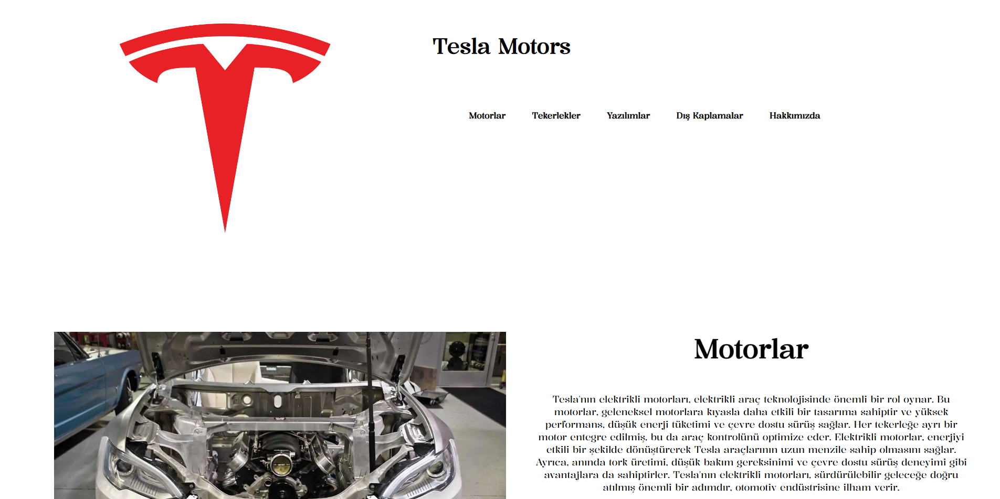
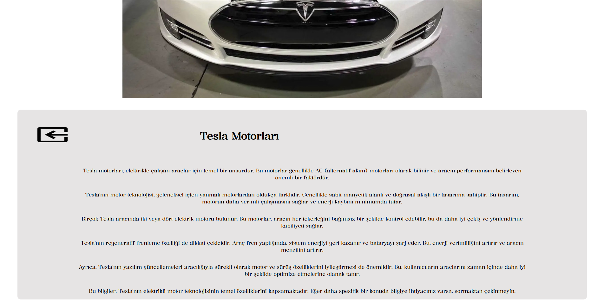

# 🚗 Tesla Motors Website Prototype — Static Design Prototype • (Archived)

 

## 📌 Project Overview

This project is a **static landing page** designed to replicate the look and feel of **Tesla Motors' website** using only **basic HTML and CSS**.  
It focuses on layout, structure, and responsive design principles without the use of any frameworks or JavaScript.  
> 📌 **Archived** — This project is no longer being updated. It’s kept as part of my **learning history** and also serves as a **reference/template** for future projects I may revisit.

 

## 🖼️ Screenshots
Shown below in order:  
**1. Landing** · **2. Section**

  
  
  

 

## 🧰 Tech Stack

  
  

 

## 📜 License
This project is licensed under the [MIT License](./LICENSE).

---

© 2025 Yusuf Okan Sirkeci — [Hereetria](https://github.com/Hereetria)
